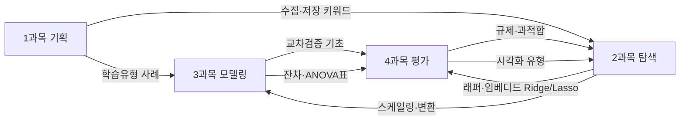

# 13회 빅데이터분석기사 필기 — 쪽집게 합격전략

> [!abstract] 근거
> 2026-08-25 김계철 라이브 특강 + 기존 정리노트 4권 + 기출응용 70문항 + 10·11회 빈출 분석.
> **시험: 2026년 9월 13회.** 80문항 / 과목당 20문항 / **48점 이상 + 과락 없음(과목당 8문항↑)**.

## 이 노트를 옵시디언에 넣는 방법

1. `정리노트/13회_쪽집게/` 폴더 전체를 볼트에 복사(또는 이 폴더를 볼트로 지정)
2. 그래프 뷰에서 `[[1과목]]` `[[2과목]]` `[[3과목]]` `[[4과목]]` 이 연결됨
3. 웹 공부: 같은 폴더의 `웹/index.html` 을 브라우저로 열기 (로컬, 서버 불필요)

| 파일 | 용도 |
|---|---|
| [[00_합격전략_쪽집게]] | 전략·회독 계획·과목 간 교집합 (지금 이 파일) |
| [[1과목_분석기획_쪽집게\|1과목 분석기획]] | 전략 과목. 타깃 **13~14문항** |
| [[2과목_탐색_쪽집게\|2과목 탐색]] | 방어 과목. 1·2장으로 과락 방어, 타깃 **11~12** |
| [[3과목_모델링_쪽집게\|3과목 모델링]] | 방어 과목. 군집·앙상블이 전략, 타깃 **11~12** |
| [[4과목_결과해석_쪽집게\|4과목 결과해석]] | 전략 과목. 타깃 **13~14문항** |

---

## 1. 합격 숫자 — 이것만 먼저 고정

```
80문항 중 48문항 이상  = 평균 60점
과목당 최소 8문항      = 과락 방지
현실 하한선            = 과목당 10문항 (10 아래로 떨어지면 48 맞추기 매우 어려움)
```

| 과목 | 특강 포지션 | 타깃 | 이유 |
|---|---|---|---|
| **1 분석기획** | **전략** | **13~14** | 기출 반복·ADSP 교집합 큼, 예외 출제 적음 |
| **4 결과해석** | **전략** | **13~14** | 축이 3개뿐(평가지표·시각화·과적합). 유형 단순 |
| **2 탐색** | **방어** | **11~12** | 3장(추론통계)이 난이도 폭탄. 1·2장에서 선점 |
| **3 모델링** | **방어** | **11~12** | 기법마다 정의·차이점만. 군집·앙상블이 득점원 |

> [!danger] 특강 한 줄
> **1과목과 4과목을 하나의 과목처럼 묶어 회독하라.** 2·3은 방어. 1·4에서 여유를 만들어야 2·3 난이도 스파이크를 버틴다.
> 이번 주에 1·4를 못 끝내면 합격률이 크게 떨어진다.

---

## 2. 시험의 출제 습관 (빅분기 ≠ ADSP)

| | ADSP | **빅분기 필기** |
|---|---|---|
| 과목 수 | 3 | **4** (깊이보다 **전 범위 회독**) |
| 정의 문제 | ~60% | **~40%** |
| 옳지 않은 것(오답 고르기) | 20~30% | **20~30% + 정의보다 어려움** |
| 난이도 | 중간 많음 | **아주 쉽거나 아주 어려움. 중간이 거의 없음** |
| 기출 재반복 | 높음 | **1과목은 높음, 2·3은 새 문항을 만들려 함** |

> [!warning] 학습법 함정
> 모의고사·적중 문제에 시간 쏟지 마라. 빅분기는 **새 문항**을 만든다. **개념을 한 번 더 보는 쪽이 오래 남는다.**
> 교재 200~300p를 들고 다니면 하루 2과목 회독이 불가능하다. **요약은 절대 150p를 넘기지 말고, 가능하면 100p 이하, 특강 권고는 A4 50장.**

**회독 가능 시간 가정 (특강)**
- 평일 최대 2~3시간
- 주말 몰아치기
- 이 시간에 1·2·3·4를 **같은 주에 여러 번** 보려면 분량이 짧아야 한다

---

## 3. 과목 간 교집합 — 한 번 정리하면 두 과목 점수

특강이 가장 강조한 것: **같은 개념이 과목을 옮겨 다닌다.** 여기서 회독 효율이 난다.



| 개념 | 주력 과목 | 겹치는 과목 | 한 줄 |
|---|---|---|---|
| 지도/비지도/강화/준지도 | 1 | 3 | 사례 보고 고르기 |
| Ridge / Lasso / Elastic Net | **2 임베디드** | **4 규제** | L1=변수선택, L2=축소만 |
| 교차검증 K-fold·LOOCV·부트스트랩 | 4 (세분) | 3 (분할) | 층화K-fold는 **비율 유지**, 불균형처리는 **비율을 바꿈** |
| 경사하강법·학습률·모멘텀·AdaGrad·Adam | 4 | 3 신경망 | 4에서 끝내면 3은 패스 가능 |
| PCA vs 요인분석 vs SVD vs LDA | 2 | 3 다변량은 가중치↓ | 기준점은 항상 **PCA** |
| 상자그림·히스토그램 | 2 | 4 시각화 | 상자그림에 **평균 없음·데이터 수 모름** |
| 히트맵 vs 트리맵, 카토그램 | 2 고급탐색 | **4 정보시각화 3문항** | 히스토그램은 **분포** (관계 X) |
| 전진/후진/단계적 | 2 래퍼 | 3 회귀 변수선택 | 2에서 했으면 3은 패스 |
| 정규성 검정 | 2 모수검정 가정 | 4 적합도 | Shapiro, K-S, Q-Q (t-test 아님) |
| 과적합·Bias-Variance | **3 상위키워드** | 4 진단 | 과소=고편향, 과대=고분산 |
| 개인정보 가명/익명 | 1 | — | 가명=복원가능, 익명=법 미적용 |

---

## 4. 특강이 찍은 이번 회 예상 (우선순위)

### 1과목 — 반드시 50장 안에 넣을 것
1. 정형(스키마) / 반정형(메타데이터) / 비정형
2. **저장 방식 3분법: RDB vs NoSQL vs HDFS** ← 변별력
3. ETL, **ODS**, DW vs DM, **Data Lake (Schema-on-Read) vs DW (Schema-on-Write)**
4. 분석 4유형(묘사·진단·예측·처방)
5. 조직(집중·분산·기능), 소프트 스킬, 준비도·성숙도 → 도입형/확산형
6. 거버넌스 구성요소
7. 에코시스템: Spark, Kafka, Zookeeper, Hive (인메모리 vs 디스크)
8. 계층: 소프트웨어 → 플랫폼 → 인프라 (빨간 키워드로 계층 맞추기)
9. 학습 유형 사례 + 준지도
10. 가명정보까지가 개인정보, 익명정보는 아님
11. 하향식/상향식 **프로세스 순서**
12. KDD / CRISP-DM / 빅데이터 방법론 단계·태스크
13. **모형화(변수 관계) ≠ 모델링(함수식)**
14. **Sqoop / Open API / FTP** 차이 ← 이번 회 예상
15. 전처리 기술 vs 후처리 기술
16. **비식별화 세분화**(가명 3, 총계 4, 삭제·범주화·마스킹) ← 강력 예상
17. 정형 품질 기준 **5가지** (거의 100%)
18. 진단 3단계 + 개선 3단계
19. HDFS NameNode vs DataNode, **높은 처리율(배치)이지 낮은 지연(실시간)이 아님**
20. 분산파일시스템 vs DB 클러스터
21. NoSQL 4종 + 도구 매칭
22. MapReduce = **무공유(Shared Nothing)** 아키텍처

### 2과목 — 1·2장으로 방어, 3장은 기본 개념만
- 전처리 4: 정제·통합·축소·변환
- 정제 = 결측 + 노이즈 + 이상값 (처리 방법 각각)
- **래퍼(전진·후진·단계) vs 임베디드(Ridge/Lasso/Elastic)** 100%
- PCA를 기준점으로 요인분석·SVD·LDA 차이만
- 변환(분포를 바꿈) vs 스케일링(상대 크기) — **MaxAbs·Robust가 변별**
- 불균형 처리(비율을 **바꿈**) ≠ 층화 K-fold(비율을 **유지**)
- 임계값 이동은 **검정 단계**, 학습 데이터에서 바꾸지 않음
- 상관: 독립→공분산 0 / 스피어만=서열·비선형 가능
- 상자그림으로 **데이터 수·가설검정 불가**
- 비정형: 토큰화·POS·스테밍·표제어만 (깊이 금지)
- 3장: 모수/비모수, 표본추출 4, 척도 4, 조건부확률, 이산분포 기댓값·분산, CLT, 불편추정량, 신뢰구간 성질, 1·2종 오류

### 3과목 — 기법당 문장 3개를 넘기지 말 것
- **Bias-Variance**가 전 과목 상위 키워드
- 사례 보고 분석법 고르기 (실기 3유형과 동일)
- 회귀: 가정, ANOVA표로 F·R², 잔차 진단 (도구 출력 해석 문제는 안 나옴)
- 로지스틱: 로짓 변환, 모형 유의성 = **카이제곱**, 오즈 해석
- 의사결정나무: 불순도 3종, 비모수, 가지치기
- ANN+딥러닝 합쳐 2~3문항 (활성화함수, CNN/RNN/LSTM)
- SVM: C·하드/소프트 마진 / KNN: K↑ 경계 단순
- **군집이 전략** (계층 vs 비계층, 덴드로그램, 병합 5, K-means vs DBSCAN vs SOM)
- 연관규칙은 1문항·계산 가중치↓ / 시계열 약 2문항
- 앙상블 1문항 이상: 배깅·부스팅·RF·스태킹 **+ 부스팅 계열 이름**
- 비모수 예상: 윌콕슨 부호순위(대응 t) / 윌콕슨 순위합(독립 t)

### 4과목 — 축이 3개, 여기서 10문항
1. **회귀/분류 평가지표** 3~4문항
2. **정보 시각화** 3문항 + 인포그래픽 1
3. **과적합 방지 4 + 교차검증 세분 + 경사하강/옵티마이저**
- 교차검증: K-fold, 층화, LOOCV, LPOCV, 몬테카를로, 부트스트랩
- 배치정규화: **주목적은 학습 안정화**, 부수적으로 과적합 방지 (기출된 함정)
- 하이퍼파라미터 탐색은 가중치↓ (그리드 vs 랜덤 vs 베이지안 정의만)
- 마지막 1문항: 모니터링·리모델링·운영 시 고려사항

---

## 5. 남은 기간 회독 리듬

| 회독 | 무엇 | 시간 |
|---|---|---|
| 1회독 | 이 폴더 1→4→2→3 순서. 형광(특강)만 밑줄 | 주말 1일 + 평일 1일 |
| 2회독 | 과목 끝 **직전 체크리스트** + 함정 박스만 | 평일 2일 (하루 2과목) |
| 3회독 | `웹/index.html` 퀴즈 + 차이점 표만 | 시험 전날 |

**하루 루틴 (2시간)**
1. 40분: 전략 과목 하나 (1 또는 4)
2. 40분: 방어 과목 하나 (2 또는 3) — 해당 과목의 **쉬운 장만**
3. 20분: 교집합 표 (Ridge, K-fold, 시각화, 학습유형)
4. 20분: 직전 체크리스트 OX

---

## 6. 표기 규칙 (전 과목 공통)

| 기호 | 의미 |
|---|---|
| **특강** | 8/25 라이브에서 형광·빨간색으로 찍은 포인트 |
| **100%** | 특강이 “반드시/거의 100%”라고 한 것 |
| **함정** | 옳지 않은 것 유형·바꿔치기 선지 |
| **교집합** | 다른 과목과 겹침. 한 번만 깊게 |
| ★ | 10·11회 등 실제 기출 확인 |

> [!tip] 압축 원칙 (특강 원문)
> 기법마다 문장을 세 개 이상 쓰지 마라. **특징 또는 다른 기법과의 차이점**만.
> 서술로 잔뜩 모으면 회독이 안 된다. **키워드 → 차이점 두 줄**이 전부다.
